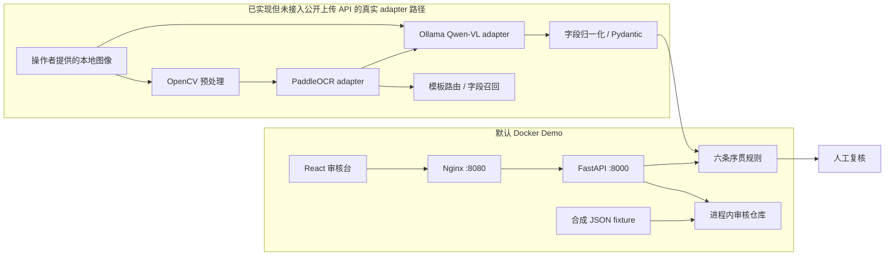
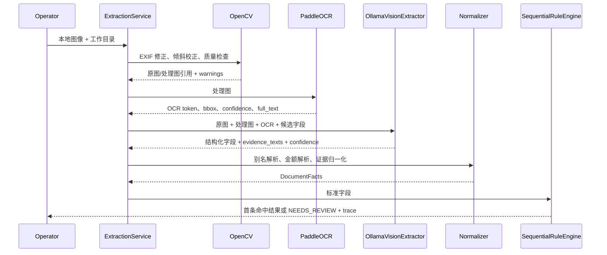

# 架构与工程边界

## 1. 两条运行路径



默认 Compose 只启动 `api` 和 `web`，可以离线演示字段、证据、规则 trace、字段修正和审核决定。它不启动 PaddleOCR、Ollama、GPU、数据库或任务队列。

真实 adapter 路径位于 `backend/src/claim_ai/adapters/` 与 `backend/src/claim_ai/pipeline/`。目前通过依赖注入和测试调用，没有包装成公开上传接口；这样避免把“源码具备能力”误写成“生产服务已上线”。

## 2. 真实抽取时序



## 3. 规则边界

- 固定优先级为 `R001 → R006`。
- 第一条 `MATCHED` 停止；第一条 `NEEDS_REVIEW` 也停止，避免低置信高优先级场景被后续规则“算出一个看似确定的数”。
- 所有金额使用 `Decimal`；`null`、空字符串、零和非法金额分别处理。
- 计算器只调用受控 Python handler，不执行模型生成表达式，也不使用 `eval()`。
- 返回 `selected_rule`、`formula`、`inputs`、`trace`、`warnings` 与规则版本，便于复核。

## 4. 信任边界与已实现保护

1. **图像/OCR 是不可信输入**：系统 Prompt 明确要求忽略票据内指令；OCR 文本被序列化进输入数据而不是拼成系统指令。
2. **模型输出不直接成为业务事实**：候选字段白名单、禁止额外字段的 Pydantic Schema、金额解析和标准字段目录形成多层约束。
3. **证据与置信度绑定**：模型证据必须匹配 OCR token；没有证据的金额候选会被降低最高置信度，触发人工复核边界。
4. **错误信息脱敏**：Ollama/Paddle/流水线错误映射为稳定类型，不把原始 OCR、响应正文或文件路径暴露到公共错误。
5. **公开仓库 fail-closed**：脚本拒绝权重、真实图片风险、密钥、本机路径、内部目录和不可解码二进制。

限制同样明确：demo API 没有认证，审核状态仅在单进程内存中；它只适合本地演示，不能直接暴露到公网。

## 5. Demo 状态与并发

- fixture 每次进程启动时载入内存。
- 仓库使用进程内锁保护修改，并返回深拷贝。
- 字段修正和审核决定要求 `expected_version`；版本不一致返回冲突，避免同进程内静默覆盖。
- 审计事件只保留事件类型、字段名、版本、时间和决定，不记录修正前后敏感原文、原因或评论正文。
- 多副本之间不共享状态，容器重启会复位；这是已知 demo 限制。

## 6. 生产演进

```text
Nginx / TLS
  → 带 JWT/RBAC 的 FastAPI
  → PostgreSQL（案件、字段、版本、审计事实来源）
  → Redis + Celery（幂等异步任务、重试）
  → MinIO（私有原图/处理图）
  → 隔离的 OCR / VLM worker 与指标系统
```

演进时还需要文件头校验、恶意文件扫描、对象级权限、字段脱敏、密钥管理、数据保留策略、评测集和告警。以上均是未来设计，不是当前仓库已实现能力。
